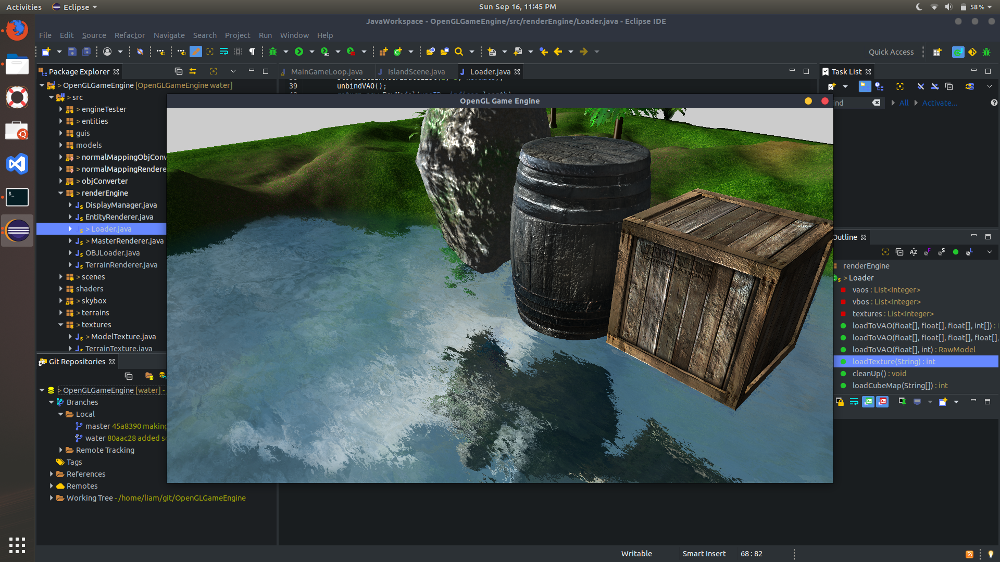

## OpenGLGameEngine
This game engine is built using OpenGL and java.

## Dependencies
- [LWJGL 2](http://legacy.lwjgl.org/) (The [third version](https://www.lwjgl.org/) is out, but I stil preffer 2).
- [Slick Util](http://slick.ninjacave.com/slick-util/)

## Installation
- Download [Java](https://www.java.com/en/download/)
- Get all of the dependices
- `git clone https://github.com/BramDaily/OpenGLGameEngine.git`

## Screenshots

## Credits
This engine was built vaguely around the OpenGL tutorial by ThinMatrix. It was really helpfull and if you want to learn how to use LWJGL and OpenGL, go to his youtube [channel](https://www.youtube.com/user/ThinMatrix).

MIT © [Liam Brady]()
